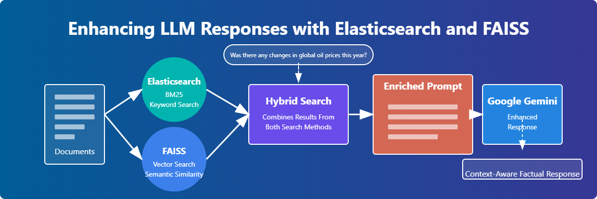

# Enhancing LLM Responses with Elasticsearch and FAISS



A Retrieval-Augmented Generation (RAG) system that improves Large Language Model responses through hybrid search, combining the keyword-based power of Elasticsearch with the semantic understanding of FAISS.

## 📋 Overview

This project demonstrates how to enhance the factual accuracy and relevance of Large Language Model (LLM) responses by implementing a hybrid retrieval system that:

- Uses **Elasticsearch** for keyword-based search (BM25 algorithm)
- Leverages **FAISS** (Facebook AI Similarity Search) for semantic similarity search
- Combines both approaches to retrieve the most relevant information
- Enriches prompts sent to LLMs with factual context
- Improves answer quality by providing source knowledge

The result is a question-answering system that delivers more accurate, context-aware responses than using a standalone LLM.

## ✨ Features

- **Hybrid Search Architecture**: Combines both semantic and keyword search methodologies
- **Elasticsearch Integration**: Utilizes BM25 algorithm for precise keyword matching
- **FAISS Vector Search**: Implements efficient similarity search using embeddings
- **Sentence Transformers**: Generates high-quality text embeddings for semantic search
- **Response Comparison**: Demonstrates the difference between LLM responses with and without context
- **Google Gemini Integration**: Uses Google's Gemini 1.5 Flash model for response generation
- **Prompt Enrichment**: Automatically formats retrieved information for optimal LLM prompting

## 🚀 Getting Started

### Prerequisites

- Python 3.8+
- Elasticsearch 7.x
- Google Gemini API key (or other LLM provider)

## 📊 Example Results

### Query
```
Was there any changes in global oil prices this year?
```

### Standard LLM Response (Without Context)
```
I do not have access to real-time information, including constantly changing data like global oil prices.

To get the most up-to-date information on global oil prices, I recommend checking reputable financial news sources like:

* Bloomberg
* Reuters
* Financial Times
* The Wall Street Journal
...
```

### Enhanced LLM Response (With Context)
```
Yes, there have been significant changes in global oil prices this year.

The provided information states that oil prices have hit a three-year low, with Brent crude falling to $70 per barrel in early September 2024. This drop is attributed to a slowdown in global oil demand, particularly due to economic challenges in China.

Therefore, the answer is yes, there have been changes in global oil prices this year, with prices dropping to a three-year low.
```

## 🏗️ System Architecture

The system follows a four-stage architecture:

1. **Document Indexing**:
   - Text documents are indexed in Elasticsearch for keyword-based retrieval
   - Document embeddings are generated and stored in FAISS for semantic retrieval

2. **Hybrid Search**:
   - User queries are processed through both Elasticsearch (BM25) and FAISS (vector similarity)
   - Results are combined with deduplication to provide diverse, relevant content

3. **Prompt Enrichment**:
   - Retrieved documents are formatted into a structured prompt
   - Context is presented clearly to guide the LLM

4. **Response Generation**:
   - The enriched prompt is sent to the LLM (Google Gemini)
   - The LLM generates a response based on both the query and the provided context

## 🔧 Customization Options

The system can be customized in several ways:

- **Embedding Models**: Replace `all-MiniLM-L6-v2` with other models from the Sentence Transformers library
- **Search Parameters**: Adjust `top_k` values to retrieve more or fewer documents
- **LLM Provider**: Switch from Google Gemini to other providers like OpenAI, Anthropic, etc.
- **Index Configuration**: Modify Elasticsearch mappings for more advanced text analysis
- **Weighting Strategy**: Implement custom logic to prioritize results from either search method

## 🔮 Future Improvements

- **Document Preprocessing**: Add support for PDF, Word, and other document formats
- **Better Results Fusion**: Implement more sophisticated ranking algorithms for combining results
- **Query Expansion**: Use LLMs to expand user queries for better retrieval
- **User Interface**: Create a web interface for easier interaction
- **Streaming Responses**: Implement streaming for real-time response generation
- **Source Evaluation**: Add confidence scoring for retrieved documents
- **Multi-language Support**: Extend to other languages beyond English

## 📄 License

This project is licensed under the MIT License - see the [LICENSE](LICENSE) file for details.
